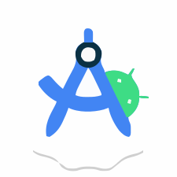

# Tanvir Hossan
### Flutter Developer | AI Enthusiast 

 

  

 

---

### About  
I am **Tanvir Hossan**, a passionate `Flutter Developer` and an enthusiastic learner in `Artificial Intelligence`. I am driven by the belief that technology can solve real-world problems when combined with creativity, persistence, and clean engineering.

I describe myself as someone who never gives up—I stay focused on learning, improving, and executing ideas with precision. Whether building mobile apps, optimizing user experiences, or experimenting with AI-powered solutions, I always aim for clean architecture, high performance, and scalable results.

With a strong curiosity and a mindset for continuous growth, I enjoy turning complex challenges into simple, elegant digital products that make an impact.

---

### Love to Code

  
  
  
  
  
  
  
  
  
  

---

### Favourite Tools

  
  
  
  

---

### Working Area  

1. Flutter Mobile App Development  
2. Basic AI and Machine Learning Projects  
3. API Integration & Backend Communication  
4. UI/UX Focused App Development  
5. Problem Solving and Competitive Programming
   
---

### Completed Learning & R&D  

1. OOP and structured programming in C & C++  
2. Flutter fundamental & state management  
3. REST API integration using Node.js  
4. Basics of machine learning  
5. Clean UI building with Flutter  
6. Git & GitHub for project management  

